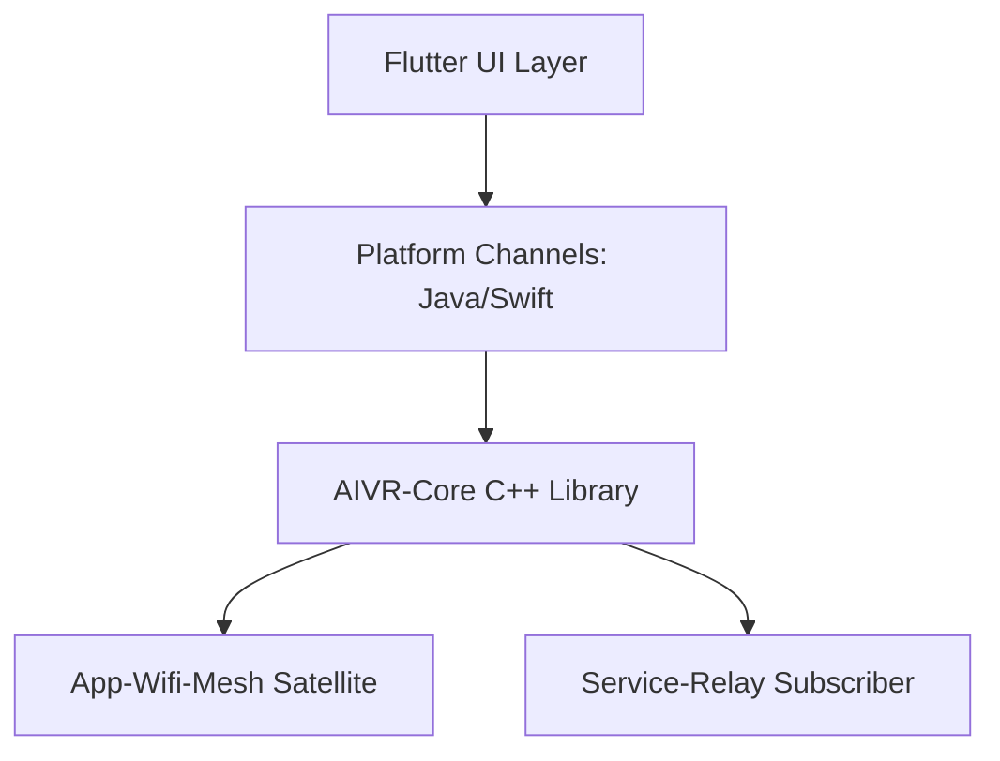

# AI-Mobile-Host — ARCHITECTURE.md

## 1. System Role: The "Body" (Mobile UI/Sensor)
**AIVR-AI-Mobile-Host** is the portal to the AIVR ecosystem on mobile devices (Android/iOS). It provides the primary user interface for mobile interaction and bridges mobile-specific hardware (GPS, IMU, Camera) into the C++ Axon bus.

## 2. Component Topology

## 3. The Hybrid Flutter/C++ Model
The UI is built with **Flutter** for rapid iteration and cross-platform consistency. The business logic, networking, and P2P discovery are handled by the linked **AIVR-Core C++** library via FFI (Foreign Function Interface).

## 4. Mobile Sensor Pipeline
Sensors (Accelerometers, Gyroscopes) are sampled at 60Hz and "Emitted" as binary vectors through the `App-Wifi-Mesh` to the PC Host for real-time tracking or gesture recognition.

## 5. Biometric Identity Bridge
On login, the app uses native FaceID/Fingerprint APIs. The resulting signature is verified by `Service-OAuth` during the initial handshake.

## 6. Communication: The Mobile Axon
Connects to the PC Host via Port 12000 (Mesh) and 9800 (Relay). Supports cellular fallback (via Relay Proxy) if the local Mesh is unreachable.

## 7. Role: Remote Hub Dashboard
Provides a specialized mobile-view of the AIVR Hub, optimized for touch interaction and high-contrast environments (e.g., outdoor use).

## 8. State Machine (Mobile Flow)
- `DISCONNECTED`: Awaiting discovery.
- `SEARCHING`: Scanning local Wi-Fi for PC Host.
- `CONNECTED`: Sensors streaming, UI active.
- `BACKGROUND`: UI hibernated, low-power sensor polling.

## 9. Implementation Detail: Native Plugins
- **Android:** JNI (Java Native Interface) bridge.
- **iOS:** Objective-C++ wrapper for the AIVR core.

## 10. Links
- [Plugin API](../docs/API_SPEC.md)
- [Sensor Schema](../docs/SCHEMA.md)
